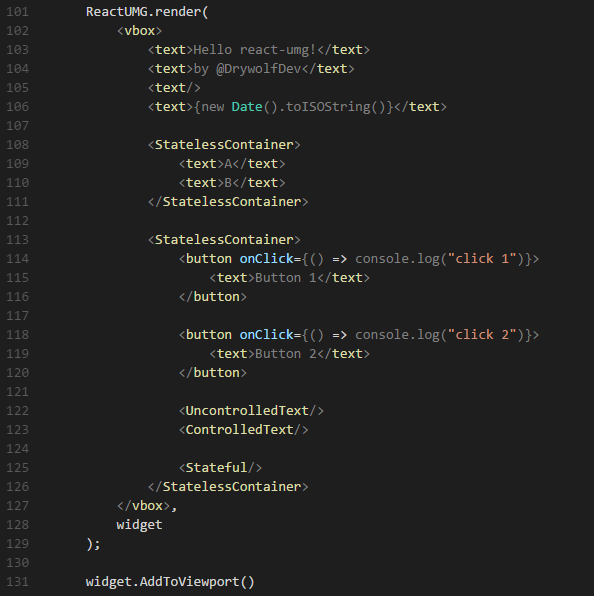
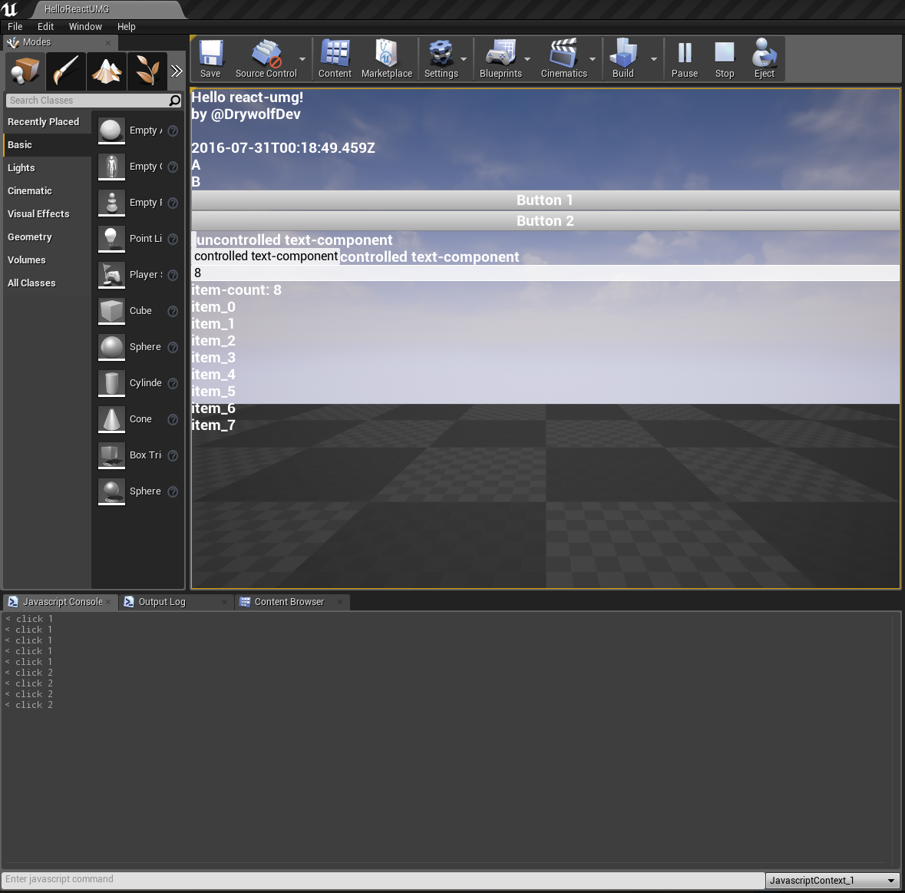

# react-umg
A React renderer for Unreal Motion Graphics (https://docs.unrealengine.com/latest/INT/Engine/UMG/)

### Disclaimer

This library is in a very early proof-of-concept phase. Many core features are missing and bugs are expected to happen.

### Screenshots

Building Unreal Engine 4 user interface structures with [React](https://facebook.github.io/react/) and [JSX](https://facebook.github.io/jsx/) syntax.

### Building react-umg

- `npm i`
- `npm run build`

### Running the examples

- build the react-umg code (see above)
- compile the [Unreal.js plugin](https://github.com/ncsoft/Unreal.js)
- copy the built `UnrealJS` plugin into the `examples/ReactUmgExamples/Plugins/` folder
- open the `ReactUmgExamples.uproject` UE4 project
- open the `ReactUmgExamples` level in the project
- run the level in the editor
- try out interacting with the displayed controls and the included sample behaviors

### Contact

- [@DrywolfDev](https://twitter.com/intent/follow?screen_name=DrywolfDev)

### License

- Licensed under the MIT license
- see [LICENSE](https://github.com/drywolf/ts3-overwatch-stats-plugin/blob/master/LICENSE) for details

### Credit

- This module builds upon:
	- [React.js](https://facebook.github.io/react/)
	- [Unreal.js](https://github.com/ncsoft/Unreal.js)
